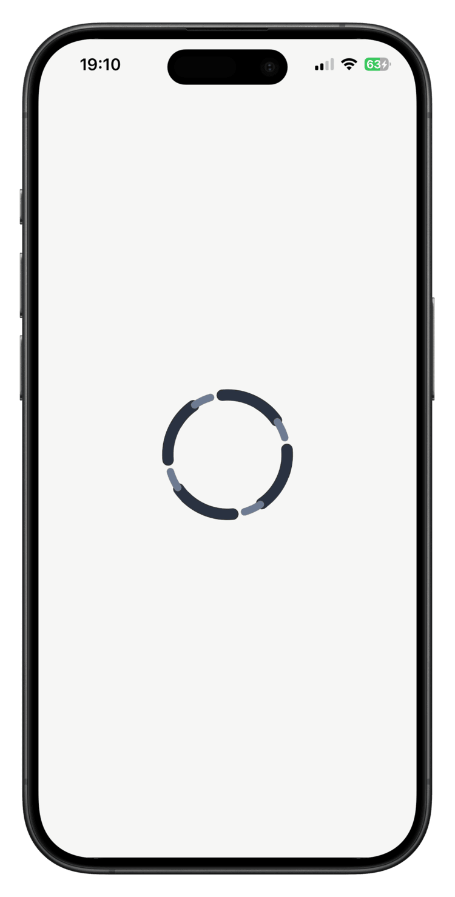
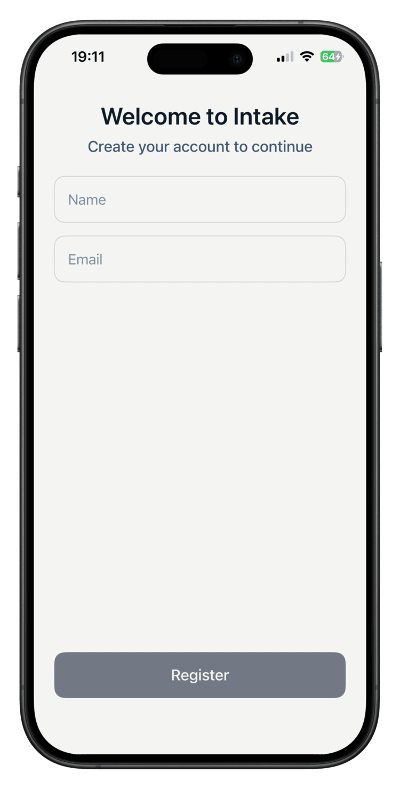
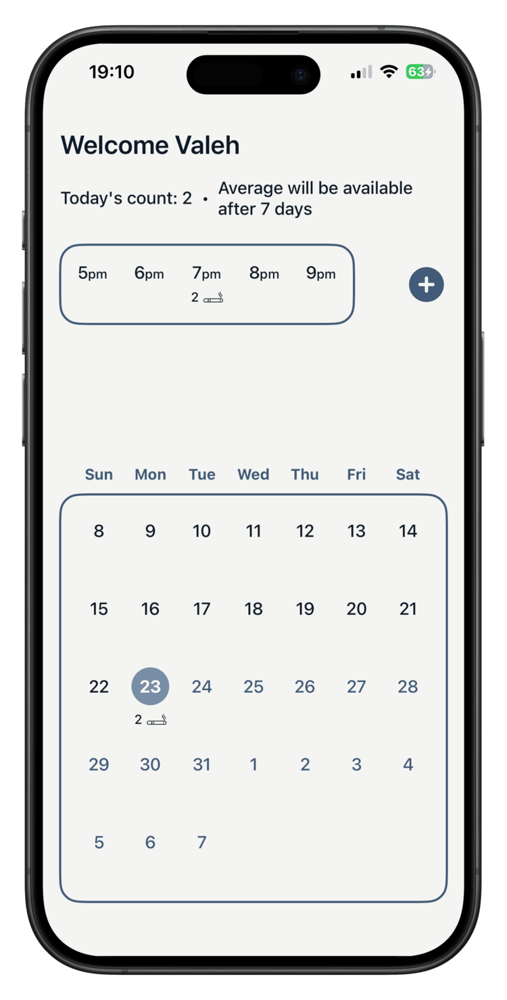
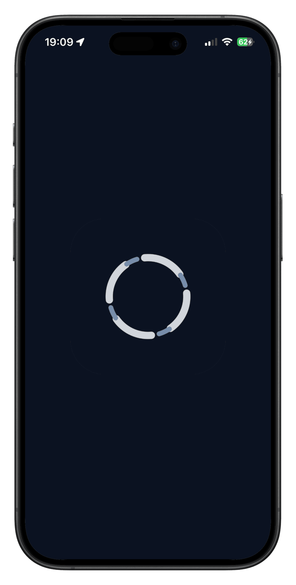
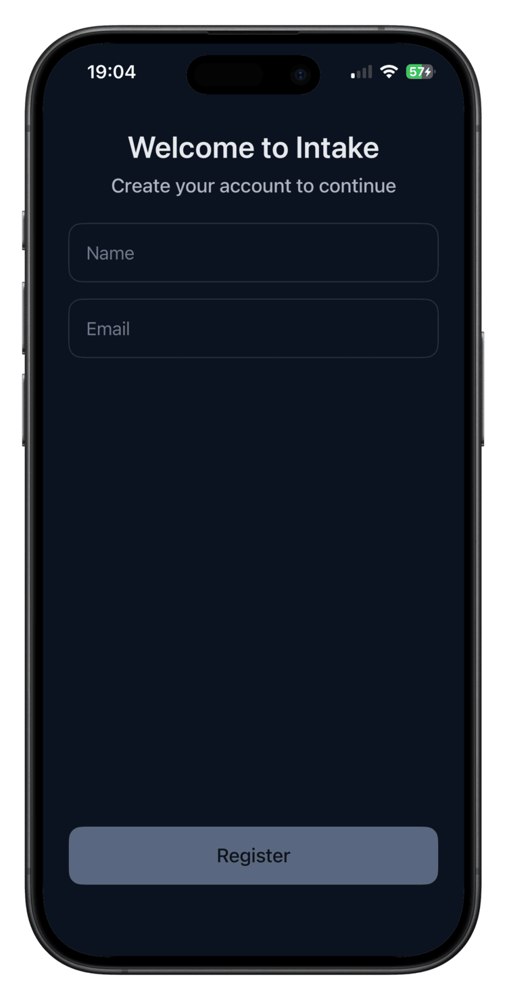
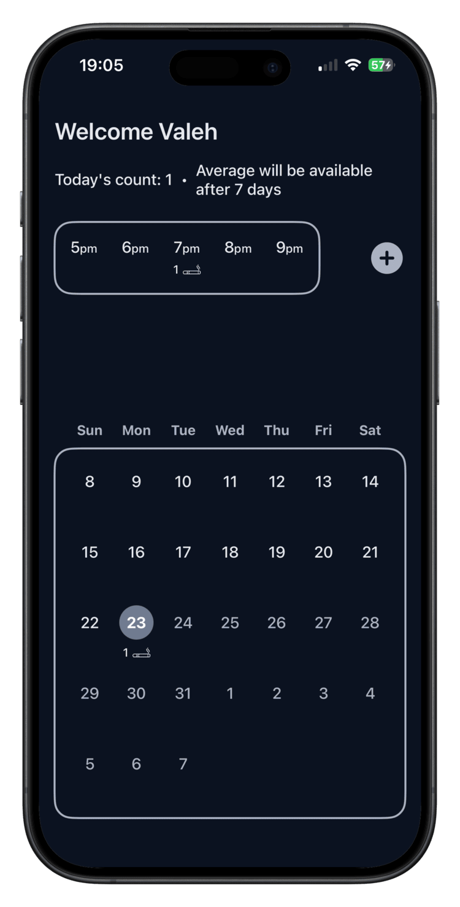

# Cigarette Tracker (SwiftUI)

An iOS application that helps users log cigarette consumption and analyze smoking patterns over time, fully offline and privacy-focused.

---

## Overview

This app was built to replace vague awareness (“I smoke too much”) with concrete data.
Users can quickly record each cigarette and review consumption trends per hour, day, and week.

All data is stored locally on the device using **SwiftData**.  
No accounts, no cloud sync, no tracking.

---

## Key Features

- **Quick logging** of cigarette intake with timestamp
- **Hourly and daily statistics** to identify peak smoking periods
- **7-day rolling average** to visualize short-term trends
- **Calendar view** to inspect historical daily usage
- **Light & Dark mode** support
- **Offline-first & privacy-safe** (local persistence only)

---

## Technical Highlights

- Built entirely with **SwiftUI**
- State-driven UI using **MVVM**
- Persistence handled via **SwiftData**
- Modular feature-based structure
- Reusable UI components and custom ViewModifiers

---

## Architecture

The project follows a feature-oriented MVVM architecture:

- **Core**
  - Extensions
  - Custom ViewModifiers
  - Shared utilities
- **Features**
  - Isolated SwiftUI views and view models per feature
- **Persistence**
  - SwiftData models and data access logic
- **Presentation**
  - Declarative SwiftUI views with unidirectional data flow

This separation keeps UI, business logic, and persistence concerns isolated and easy to evolve.

---

## Requirements

- Xcode 16.0+
- iOS Simulator or physical iPhone

---

## Limitations

- No authentication or multi-user support
- No cloud sync or data export
- iPhone-only UI (no iPad or macOS layout)

These were deliberate scope constraints for the project.

---

## Screenshots

### Light Mode

  
  
  

### Dark Mode

  
  
  

  Launch · Register · Main

---

## Motivation

This project was created to practice:
- SwiftUI state management
- SwiftData integration
- Structuring a real-world MVVM app
- Designing a focused, single-purpose product

---

## Future Improvements

- iPad layout support
- Trend comparison over longer time ranges
- Widget support
